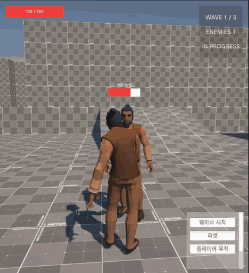
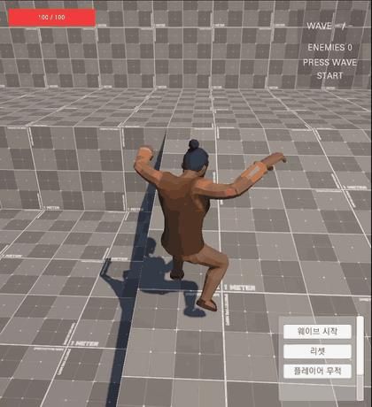
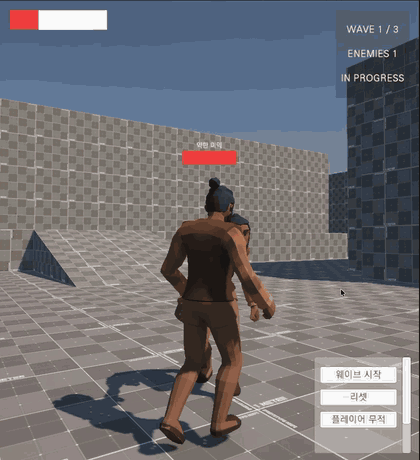

# Arena Combat

[](https://unity.com/releases/editor/archive)
[](https://docs.unity3d.com/Manual/urp/urp-introduction.html)
[](LICENSE)
[](#todo)

**Unity 3D ARPG 프로토타입.** 3인칭 시점의 전투 시스템을 만들고 있습니다.



- **판정과 표현의 분리** — 애니메이션이 아니라 데이터가 판정 시점을 정합니다
- **상태 소유권 설계** — 유닛의 상태를 누가 소유하고 누가 바꾸는가
- **직접 구현** — 3인칭 카메라는 Cinemachine 없이, 적 추적은 NavMesh 위에서
- **판단의 기록** — 무엇을 채택하고 무엇을 왜 기각했는지 ([설계 결정 문서](#설계-결정-문서) 6건)

> **진행 중인 프로젝트입니다.** 지금은 *공격 → 판정 → 피격 → 사망 → 웨이브 진행*까지 한 사이클이 끝까지 도는 단계입니다.
> 목표는 완성된 게임이 아니라, 전투 판정 시스템을 세우고 **그 판단의 근거를 남기는 것**입니다.
> 지금 무엇이 되고 무엇이 안 되는지는 [구현한 것](#구현한-것)과 [TODO](#todo)에 그대로 적었습니다.

**동작은 [GIF](#동작-확인)로 확인 가능합니다. 이 저장소는 코드와 설계 판단을 읽는 곳입니다.**

<details>
<summary><b>목차</b></summary>

- [동작 확인](#동작-확인)
- [구현한 것](#구현한-것)
- [저장소 구조](#저장소-구조)
- [핵심 코드 위치](#핵심-코드-위치)
- [설계 결정 문서](#설계-결정-문서)
- [TODO](#todo)
- [기술 환경](#기술-환경)
- [라이선스](#라이선스)

</details>

---

## 동작 확인

> **실행 가능한 빌드는 제공하지 않습니다.** 아트가 private 서브모듈이라 클론해도 씬이 재현되지 않고,
> WebGL 배포는 이 저장소가 증명하려는 것(코드와 설계 판단)에서 벗어난다고 판단해 범위에서 제외했습니다.
> **동작 증거는 아래 GIF 3장입니다.**





| | 내용 |
|---|---|
| ① | 3인칭 이동 · 카메라 추적 · 점프 · 구르기 |
| ② | 웨이브 시작 → 적 추적 → 접근 → 공격 → 체력 감소 *(최상단 이미지)* |
| ③ | 피격 → 사망 → 웨이브 실패 |

### 조작

| 입력 | 동작                            |
|---|-------------------------------|
| `W` `A` `S` `D` | 이동 (카메라 상대 위치 기준)             |
| `LCtrl` 길게 누르기 | 걷기 ↔ 달리기 상태 전환 (토글, 0.75초 유지) |
| 마우스 | 시점 회전                         |
| 좌클릭 | 근접 공격                         |
| `LShift` | 구르기                           |
| `Space` | 점프                            |
| 화면 버튼 | Wave Start / Reset / 무적 토글(개발용)  |

---

## 구현한 것

| 영역 | 내용                                                                  |
|---|---------------------------------------------------------------------|
| 이동 | 카메라 상대 이동, 걷기/달리기 전환, 구르기, 점프 (`CharacterController`)               |
| 카메라 | 3인칭 궤도 카메라 **직접 구현** (Cinemachine 미사용), 피격 시 흔들림                    |
| 전투 | 근접 공격, `AttackConfig`(SO) 기반 판정, 구체 영역 판정                           |
| 판정 타이밍 | `hitImpactDelay`로 **애니메이션 시작 프레임과 데미지 반영 시점을 분리**                   |
| 피격·사망 | 순수 C# `Health` + `IDamageable`, 피격 경직, 사망 상태 전이                     |
| 적 AI | NavMesh 기반의 플레이어 추적, `enum` + `switch` 상태 전환 (Idle / Chase / Attack) |
| 스폰 | 스폰 지점 · 생성기 · 스폰 요청 DTO 분리                                          |
| 웨이브 | 진행 상태 머신 (Idle / InProgress / Preparing / Cleared / Failed)         |
| UI | 적 체력바 · 플레이어 체력 · 웨이브 정보 · 결과 표시 (스크린스페이스)                      |

---

## 저장소 구조

```text
Assets/Scripts/
├─ Player/     플레이어 이동 · 공격 · 피격
├─ Enemy/      적 AI · 이동 · 스폰
├─ Combat/     Health · IDamageable · AttackConfig
├─ Cameras/    3인칭 카메라
├─ Game/       GameDirector · 웨이브 정의
├─ UI/         체력바 · HUD
└─ Core/       LogManager · AgentDoc

docs/
├─ decisions/  설계 결정 문서 6건   ← 이 저장소의 핵심 산출물
├─ notes/      조사 · 운영 메모
├─ media/      GIF
└─ progress-log.md   진행 로그

CLAUDE.md      AI 작업 규칙
```

---

## 핵심 코드 위치

| 무엇 | 위치 | 보는 포인트 |
|---|---|---|
| 판정과 표현의 분리 | [`PlayerMeleeAttack.cs:106`](Assets/Scripts/Player/PlayerMeleeAttack.cs#L106) | Animation Event를 쓰지 않고 `hitImpactDelay` 코루틴으로 판정 시점을 잡음 |
| 공격 취소 규칙 | [`PlayerMeleeAttack.cs:89`](Assets/Scripts/Player/PlayerMeleeAttack.cs#L89) | 슈퍼아머는 "피격이 안 끊는다"는 규칙이지 "죽어도 안 끊는다"가 아님 |
| 타이머 방식 | [`PlayerMeleeAttack.cs:25`](Assets/Scripts/Player/PlayerMeleeAttack.cs#L25) | 남은 시간 감산이 아니라 **타임스탬프**. 감산은 컴포넌트 구동 순서에 의존함 |
| 데이터 검증 | [`AttackConfig.cs:29`](Assets/Scripts/Combat/AttackConfig.cs#L29) | `OnValidate`로 판정 지연이 공격 주기를 넘는 설정을 경고 |
| 상태 전이 단일 지점 | [`EnemyAI.cs:114`](Assets/Scripts/Enemy/AI/EnemyAI.cs#L114) | 상태 필드 직접 대입 없음. 모든 전이가 `ChangeState` 하나를 통과 |
| 판단과 행동의 분리 | [`EnemyAI.cs:92`](Assets/Scripts/Enemy/AI/EnemyAI.cs#L92) | `DecideNext()`는 부작용 없이 다음 상태만 반환, `Tick()`이 행동 |
| 상태 경계 진동 방지 | [`EnemyAI.cs:107`](Assets/Scripts/Enemy/AI/EnemyAI.cs#L107) | 히스테리시스로 사거리 경계에서 Chase ↔ Attack이 떨리는 것을 막음 |
| NavMesh 재요청 억제 | [`EnemyMovement.cs:76`](Assets/Scripts/Enemy/Movement/EnemyMovement.cs#L76) | 목적지 변화가 임계값 미만이면 `SetDestination`을 호출하지 않음 |
| 조립과 생명주기 | [`EnemyCharacter.cs:62`](Assets/Scripts/Enemy/EnemyCharacter.cs#L62) | `Awake` 순서에 기대지 않고 부모가 조립. 실패 시 **어느 부품인지** 로그로 특정 |
| 순수 C# 규칙층 | [`Health.cs`](Assets/Scripts/Combat/Health.cs) | MonoBehaviour 비의존. 체력 규칙만 담당 |
| 웨이브 상태 머신 | [`GameDirector.cs:151`](Assets/Scripts/Game/GameDirector.cs#L151) | 전이 시 부작용을 `ChangeState` 안에 모음 |
| 구도와 적용의 분리 | [`CameraRigProperty.cs`](Assets/Scripts/Cameras/CameraRigProperty.cs) | 카메라를 Transform이 아니라 **파라미터(yaw · pitch · distance · pivot)로** 들고 있다가 마지막에 한 번 변환. 외부 효과를 합성할 자리를 남겨둔 구조 |
| 카메라 갱신 시점 | [`CameraFollow.cs:33`](Assets/Scripts/Cameras/CameraFollow.cs#L33) | `LateUpdate` 사용. 같은 `Update` 안에서는 실행 순서가 보장되지 않기 때문 |
| 카메라 효과 합성 | [`CameraFollow.cs:75`](Assets/Scripts/Cameras/CameraFollow.cs#L75) | 흔들림은 회전이 아니라 **위치에만** 더함. 회전에 섞으면 조준 방향이 어긋남 |
| 효과 계산의 분리 | [`CameraShake.cs:46`](Assets/Scripts/Cameras/CameraShake.cs#L46) | 자체 `Update`를 갖지 않고 오프셋만 반환. 구동 시점을 `CameraFollow` 한쪽으로 모아 프레임 어긋남을 없앰 |
| HUD 의존성 방향 | [`HudPresenter.cs:74`](Assets/Scripts/UI/HudUI/HudPresenter.cs#L74) | 플레이어가 UI로 밀어넣지 않고 HUD가 필요할 때 조회. 초기화 진입점은 `GameDirector` 하나 |

---

## 설계 결정 문서

| 문서 | 결정 | 폐기 |
|---|----|----|
| [플레이어 구조](docs/decisions/component-architecture.md) | 기능 단위 컴포넌트 분리 | 중앙 `Player.cs` + 전면 순수 C# |
| [공격 판정 타이밍](docs/decisions/attack-timing.md) | 데이터 주도 (`hitImpactDelay`) | Animation Event 주도 |
| [유닛 상태 권한](docs/decisions/unit-state-authority.md) | 상태 소유·변경 권한을 독점하는 컴포넌트 | 분산 소유 |
| [적 스폰 구조](docs/decisions/enemy-spawn.md) | 스폰 지점 · 생성 · 요청 DTO · 지휘를 분리 | 스포너가 전부 소유 |
| [캐릭터 종속 UI](docs/decisions/world-space-ui.md) | 스크린스페이스 투영 | 월드스페이스 Canvas |
| [웨이브와 사망 적 정리](docs/decisions/wave-and-enemy-cleanup.md) | 전멸 판정은 목록 재계산 | `Died` 이벤트 기반 판정 |

레퍼런스로 채택한 Unity 오픈소스 프로젝트 [Boss Room](https://github.com/Unity-Technologies/com.unity.multiplayer.samples.coop)과
[Chop Chop](https://github.com/UnityTechnologies/open-project-1)의 구조를 참고하고, 이 프로젝트의 규모와 상황에 적합하게 활용했습니다.

---

## TODO

추후 구현 및 정리할 목록입니다. 당장 하지 않은 이유가 있는 항목은 함께 적었습니다.

- [ ] **피격 무적 시간(i-frame)** — 현재 `PlayerCharacter.cs:24`의 `invincible`은 디버그 플래그일 뿐입니다. 화면 버튼으로 켤 수 있으나, 데미지 진입 자체를 막는 개발용 스위치이지 무적 시간 규칙이 아닙니다
- [ ] **`Health` 유닛 테스트** — 순수 C#으로 분리한 이유가 테스트 가능성인데 아직 없습니다
- [ ] **카메라 설계 결정 문서** — Cinemachine을 쓰지 않은 판단은 있으나 문서로 남기지 않았습니다
- [ ] **카메라 Modifier 계층** — 지금은 `CameraFollow`가 `CameraShake` 하나를 직접 합산합니다.
      회전 · 충돌 회피 · 흔들림을 상태 없는 Modifier로 떼어내면 `CameraRigProperty` 단계에서 합성할 수 있습니다 ([참고](docs/notes/unity-camera-system.md))
- [ ] **체력 표현 UX 개선** — 거리에 따른 적 UI 비활성화 등. 지금은 `scanRange`(기본 8m) 안의 최근접 적 하나만 표시합니다
- [ ] **카메라 연출** — 피격 흔들림만 있습니다. 게임 시작 · 종료 시점의 연출은 없습니다
- [ ] **결과 화면** — 웨이브 `Cleared` / `Failed`는 HUD 배너 한 줄로만 표시합니다. 전용 결과 화면은 없습니다
- [ ] **부채꼴 각도 판정** — 현재는 구체 영역 판정만 있습니다
- [ ] **보상 선택 / 스탯 강화**
- [ ] **원거리 무기 · 스킬 · 락온**
- [ ] **Object Pooling · VFX** — 현재 규모에서는 넣을 근거가 없어 보류
- [ ] **Job System / Burst** — 패키지는 설치돼 있으나 소수 오브젝트 계산에 적용할 근거가 없습니다
- [ ] **네트워크(NGO)** — 단일 플레이 전제. 설계 훅 3개(입력/행동 분리, 순수 C# 규칙층, 단일 스폰 창구)만 미리 지켜두었습니다

---

## 기술 환경

| | |
|---|---|
| 엔진 | Unity 6000.3.16f1 · URP |
| 입력 | Input System (새 입력 시스템) |
| 경로 탐색 | NavMesh (`com.unity.ai.navigation`) |
| 구조 | 어셈블리 분리 (`ArenaCombat.Runtime`), `LogManager`로 로그 중앙화 + `Conditional` 처리 |
| 브랜치 | `main` ← `dev` ← `feature/*` · `fix/*` · `refactor/*` · `chore/*` · `docs/*` |

### 아트 에셋

아트는 `Assets/ThirdParty/` private 서브모듈로 분리되어 있고, 이 저장소에는 포함되지 않습니다.
Unity Asset Store에서 구매한 에셋의 원본을 공개 저장소에 두는 것은 [Asset Store EULA](https://unity.com/legal/as-terms)상 재배포에 해당하기 때문입니다.

코드와 아트의 경계가 이 이유로 나뉘어 있으며, 소스만으로는 씬이 그대로 재현되지 않습니다.
**동작 확인은 [GIF](#동작-확인)로 제공합니다.**

---

## 라이선스

코드는 [MIT](LICENSE). 아트 에셋은 각 Asset Store 라이선스를 따르며 이 저장소에 포함되지 않습니다.
